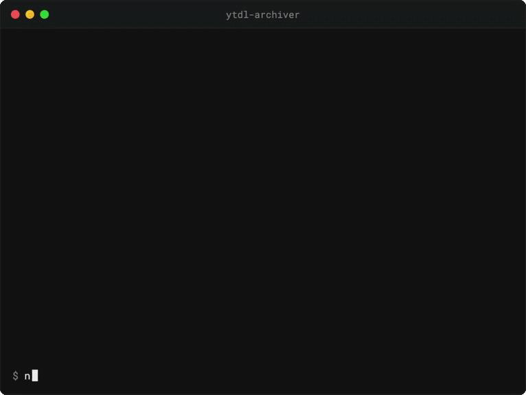

# ytdl-archiver

<p align="center">
  
</p>

Modern Python CLI for archiving YouTube playlists with media-server-friendly sidecar files.

<p align="center">
  
</p>

## Dependencies
- Python 3.14+
- [`uv`](https://docs.astral.sh/uv/)
- FFmpeg on `PATH`
- (Recommended) External JavaScript runtime (`deno` or `Node.js`) for full yt-dlp extraction compatibility
- (Recommended) Firefox for browser cookie extraction
- (Optional) Rust for setup TUI development

## Install
Install with uv (recommended):
```bash
uv tool install ytdl-archiver
```

Or with pip:
```bash
pip install ytdl-archiver
```

From source (development):
```bash
git clone https://github.com/htmlgxn/ytdl-archiver.git
cd ytdl-archiver
uv sync
```

## Quick Start

### 1. Run first-time setup
```bash
ytdl-archiver archive
```

If `~/.config/ytdl-archiver/config.toml` is missing, setup runs automatically on non-help commands and generates:
- `~/.config/ytdl-archiver/config.toml`
- `~/.config/ytdl-archiver/playlists.toml`

You can also run setup directly:
```bash
ytdl-archiver init
```

### 2. Define playlists
Edit `~/.config/ytdl-archiver/playlists.toml`:

```toml
[[playlists]]
id = "UUxxxxxxxxxxxxxxxxxxxxxx"
path = "Music/Example Channel"
name = "Example Music Channel"

[playlists.download]
format = "bestaudio"
write_subtitles = false
write_thumbnail = true
```

Notes:
- `[[playlists]]` entries are loaded from the `playlists` array.
- If both `playlists.toml` and `playlists.json` exist in the config directory, TOML is preferred.
- Playlist download overrides accept canonical snake_case keys and yt-dlp-style aliases (for example `write_subtitles` and `writesubtitles`).

### 3. Run archive
```bash
ytdl-archiver archive
```

## First-Class Commands
- `archive`: download playlists and generate sidecars
- `metadata-backfill`: backfill sidecars for already archived IDs in `.archive.txt`
- `search`: discover channels/playlists and append selected entries to `playlists.toml`
- `convert-playlists`: convert legacy JSON playlists files to TOML
- `init`: run interactive setup

## Artifact Outputs (default behavior)
Successful archive runs produce:
- Media output (for example `.mp4`)
- Metadata sidecars: `<stem>.info.json` and `<stem>.metadata.json`
- Media-server sidecar: `<stem>.nfo` (when enabled)
- Container policy defaults to max-quality/no-webm outputs (prefers mp4 when quality-tied, otherwise remuxes to mp4/mkv)
- Subtitle sidecars (language-suffixed, for example `<stem>.en.srt`) with embedding enabled by default
- Thumbnail sidecar (for example `<stem>.jpg`) when enabled

## Help
```bash
ytdl-archiver --help
ytdl-archiver archive --help
ytdl-archiver metadata-backfill --help
ytdl-archiver search --help
ytdl-archiver convert-playlists --help
ytdl-archiver init --help
```

## Documentation
- Docs index: `docs/index.md`
- CLI reference: `docs/cli.md`
- Configuration reference: `docs/configuration.md`
- Terminal output modes: `docs/terminal-output.md`
- Development/contributing: `docs/development.md`
- Migration notes: `MIGRATION.md`
- Release notes (`v0.3.0`): `docs/releases/0.3.0.md`
- Changelog: `CHANGELOG.md`
